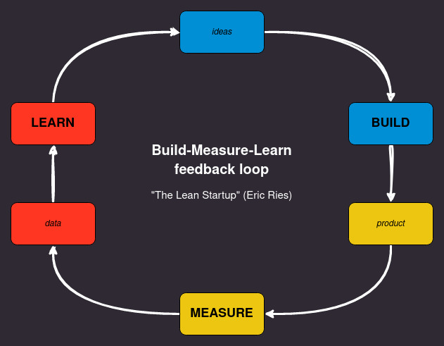
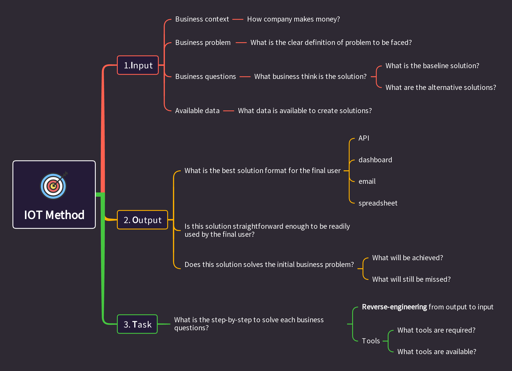
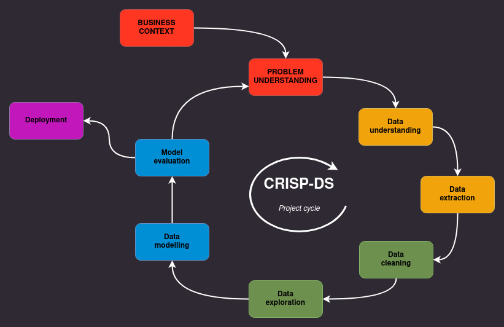

# **PROBLEM SOLVING DESIGN**



# **BUSINESS CONTEXT**
## **What is the company?**

Hotmart

## **What is its business model?**

Two-sided marketplace. It is a platform for buying, selling and promoting digital products in which Hotmart connects product creators/disseminators to their customers.

## **What is the company stage on the market?**

"Virality" (Lean Analytics) or "early majority" (Innovation Adoption Curve). The company found a pain in the market and validated a product that solves the pain; now is the time to increase the customer base.

# **BUSINESS PROBLEM**

## **What is the business problem the company is facing?**

The company wants to get insight based on customers' data in order to unveil new product opportunities, especially in terms of product success, customer segmentation, and revenue estimation.

## **What is the business solution that this project has to deliver?**

A presentation of storytelling insights based on the available data and, possibly, answers to the following questions:
- Does Hotmart depend on the biggest producers on the platform? That is, the top-selling producers are responsible for most of the
Hotmart billing?
- Are there any relevant patterns or trends in the data?
- It is possible to segment users based on their characteristics (revenue, product niche, etc.)?
- What features most impact the success of a product? that is, the What makes a product sell more?
- It is possible to estimate how much revenue Hotmart will generate in the next three months from the last month shown in the dataset?

**References:**
- Case description
- https://hotmart.com/pt-br

# **SCOPE AND BUSINESS ASSUMPTIONS**

**Business**:
- The company's focus at the moment is to scale the customer base.
- To scale, products that are sold to more customers and purchased more often are more important than products that generate more revenue.

**Data**:
- When the affiliate commission percentage is null (absent), it was considered as being zero (0).
- The value of purchase_value is represented on the z-score scale.

---

# **SOLUTION DESIGN**



### INPUT

- **Business context**:
    - It is a platform for buying, selling and promoting digital products in which Hotmart connects product creators/disseminators to their customers.
    - In principle, Hotmart makes money by **taxing**, either the creators or the disseminators, **a percentage of the purchase by the customer**.
- **Business problem**:
    - The company wants to get **insights** based on customers' data in order to **unveil new product opportunities**, especially in terms of product success, customer segmentation, and revenue estimation.
- **Business questions**:
    - Does **Hotmart depend** on the **biggest producers** on the platform? That is, the **top-selling producers** are responsible for **most** of the Hotmart **billing**?
    - Are there any **relevant patterns or trends** in the data?
    - It is possible to **segment users** based on their characteristics (revenue, product niche, etc.)?
    - What **features most impact** the success of a **product**? that is, the What makes a **product sell more**?
    - It is possible to **estimate** how much **revenue** Hotmart will generate in the **next three months from the last month** shown in the dataset?
- **Available data**:
    - Data referring to a **sample of purchases made** at Hotmart in 2016. These are more than 1.5 million records of purchases made on our **platform**.

### OUTPUT 

- A presentation of storytelling insights based on the available data and, possibly, answers to the previous questions.

### TASKs

- *QUESTION*:
    - Does **Hotmart depend** on the **biggest producers** on the platform? That is, the **top-selling producers** are responsible for **most** of the Hotmart **billing**?
        - What are the biggest producers on the platform? What is its definition?
            - Assuming higher than 95th percentile of volume of product sold.
        - What it means to be dependent on some producers?
            - Assuming "Pareto rule" like: 80% of revenue comes from the 5th top selling producers
        - What is the revenue difference from this customers to the remaining one?
            - Compare revenues

<br >

- *QUESTION*:
    - Are there any **relevant patterns or trends** in the data?
        - Check for features (correlation between features, feature distributions and time-changes trends) that shows patterns in terms of customers/producers groups or revenue impact or scaling impact.

<br >

- *QUESTION*:
    - It is possible to **segment users** based on their characteristics (revenue, product niche, etc.)?
        - What is the purpose of segmenting customers?
          - Find out what are the best customers and what coould be done to change the behaviour of the not-best ones. 
          - Revenue from best customer could support scaling efforts.
        - Check for features that can cluster customer/producers for better revenue undestanding
          - Initially try RFM (Recency-Frequency-Monetary)

<br >      

- *QUESTION*:
    - What **features most impact** the success of a **product**? that is, what makes a **product sell more**?
        - Success of a product = number of products sold
            - Inspect features with high correlation to the number of product sold
            - Inspect feature with high correlation with an increasing trend of products sold
            - Check for simple causal inference techniques
              - knowing features that best impact the product success, we can use this feature for marketing purpose (scalling effort) and, perhaps, get a better overview about what leads to focus on.

<br >

- *QUESTION*:
    - It is possible to **estimate** how much **revenue** Hotmart will generate in the **next three months from the last month** shown in the dataset?
        - Check the revenue time-series to understand how to extrapolate it to the future
            - Visual inspection
            - Check for trend and seasonality and noise
            - Define baseline (dummy = last available date)
                - Initially, ARIMA model
                - If possible, machine learning models
                - Check model error and extrapolate to business impact
                  - knowing revenue forecast we can predcit scaling investments and even prepone investments.

# **PRODUCT BUILDING ROADMAP**




## **Notebook sections**

### **Step 00. Helpers**:
Import libraries, define functions, setup environment and constants

### **Setup 01. Data Extraction**:
Inspect ERD (Entity-Relationship Diagram) and the meaning of the available data as well as extract (and merge, if needed) data from data sources onto dataframes.

### **Step 02. Data Description**:
Rename columns, check the number of rows and columns, inspect data types, validate data, deal with missing values then do basic summary statistics to get intuition about the data.

### **Step 03. Feature Engineering**:
Create a hypothesis list to validate on Exploratory Analysis (EDA) and create the required features to EDA as well as for machine learning modelling.

### **Step 04. Data Filtering**:
Filter rows and columns that do not contain information for modelling or do not match the scope of the business (e.g. predict sales for a closed store).

### **Step 05. Exploratory Data Analysis**:
Analyse each variable alone (univariate analysis) and the relationship among variables in pairs (bivariate analysis). Then, validate the hypothesis list (one by one) to raise insights. Finally, perform a dimensionality reduction exploration to get intuite if such technique may be helpful for ML modelling.

### **Step 06. Business Hypothesis**:
Validate business hypothesis and generate insights/actionables. Besides, create data products to help solving business problems.


# **NEXT STEPS TO IMPROVE**

- Iterate one more CRISP-DM cycle at the points where there is greater delivery of value to the business.
- Validate understanding of insights with the business team.
- Deepen exploratory and time series modeling to estimate revenue.
- Validate the business value and use of RFM segmentation.
- Deepen product clustering to improve the distinction between clusters as well as define the consumption of this clustering
- Define deployment architecture for revenue forecasting model and product clustering model.


---

# **PROJECT FOLDER STRUCTURE**
```bash
.
├── artifacts
│   └── rfm                # artifact to deploy streamlit app
├── data
│   ├── processed_data
│   └── raw_data
├── img
│   ├── data_exploration
│   ├── experiment_tracking
│   ├── hypothesis_validation
│   └── project_structure
├── notebooks
├── storytelling           # store files required for ppt creation
├── Dockerfile
├── README.md
├── MANIFEST.in
├── requirements.txt       # dependencies for the python package created for this project
├── scripts                # python package scripts created for this project
├── tests                  # test for the python package created for this project
├── project_lib            # python package (with modules) created for this project
└── setup.py               # python script to setup the python package created for this project
```
---